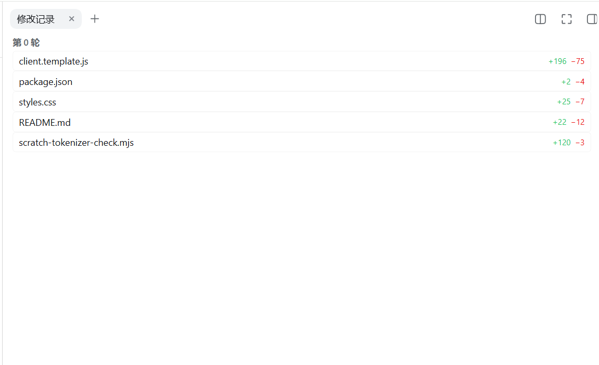
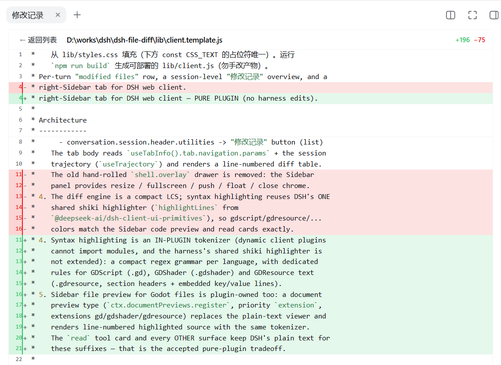

# dsh-file-diff — File Diff Overview（文件修改总览）

DSH Web 的修改文件总览插件：在每轮会话末尾展示「修改 N 个文件」行（文件 chip 点击后在**右侧边栏**打开该文件的 diff），在会话头部提供「修改记录」按钮（会话级文件修改总览）。diff 视图作为右侧边栏的一个 tab（kind `filediff`）渲染，复用侧边栏的 dock 面板能力（缩放、全屏/push、浮动、关闭）。**纯插件实现**：不改 DSH 仓库；内置分词器支持 GDScript（`.gd`）、GDShader（`.gdshader`）、GDResource（`.gdresource`），并自注册这些文件的侧边栏高亮预览。

------

会话修改文件总览

单个文件修改内容（右侧边栏 tab）


## 安装步骤（把本包作为正式客户端包装入 ~/.dsh/profiles/web/）

### 1. 让 profile 的 Loader 能解析该包

**原理（先读）**：`client-modules` 扫描 Loader 的 entry——组合里那一行的 `name` 就是
**包 specifier**，由 Loader 从 profile 树做 node 解析（根在 `%HOME%\.dsh\profiles\web\`），
解析出包的 `package.json`，再读 `dsh.client` 声明 + `exports["./client"]` 注册为 web 插件。
所以关键只有一条：**该包必须能被 profile 的 node 解析找到**（通常在
`profiles/web/node_modules/dsh-file-diff`）——至于它是 pnpm 链接、junction 还是复制目录都可以。

> ⚠️ `healProfileModuleFallback` 只投影「所选 bundle 依赖闭包」里的包到
> `.dsh-module-fallback\node_modules`，并会在启动时**删除**不在该闭包中的自有链接。
> 因此**不要把用户包塞进 `.dsh-module-fallback`**（旧做法已被清理逻辑废弃）。

**推荐做法 A：加为 profile 依赖（最标准，源码留在原位不复制）**

在 `%HOME%\.dsh\profiles\web\package.json` 的 `dependencies` 加（`file:` 路径相对
profile 目录解析，跨盘建议写绝对路径，注意用正斜杠）：

```json
"dsh-file-diff": "link:./dsh-file-diff"
```

然后在该目录执行：

```sh
cd %HOME%\.dsh\profiles\web
pnpm install
```

pnpm 会以链接形式把它放进 `profiles/web/node_modules/dsh-file-diff`（真实文件仍在你的工作区，不复制两份）。

**做法 B：手动 junction（不装依赖）**

```sh
mklink /J "%HOME%\.dsh\profiles\web\node_modules\dsh-file-diff" ".\dsh-file-diff"
```

**做法 C：直接复制**（能工作，但不受 pnpm 管理、易漂移，不推荐）：

```sh
robocopy .\dsh-file-diff "%HOME%\.dsh\profiles\web\node_modules\dsh-file-diff" /E
```

### 2. 在 profile 组合加一行

编辑 `%HOME%\.dsh\profiles\web\cordis.patch.yml`，追加。**`name` 必须是包名
`dsh-file-diff`**（Loader 按它解析；client-modules 也按它校验 bundle 注册，见下）。
`id` 只是该行在组合里的标识，可任意：

```yaml
- insert:
    - id: filediff-overview
      name: 'dsh-file-diff'
```

新增包名需要 Loader 在启动时解析（模块链接步骤 1 也要在启动前就位），完成后**重启 dsh web 进程**最稳：

```sh
dsh web --profile web
```

### 3. 本包的 `dsh.client` 声明（无需手动操作，构建/启动时自动生效）

- `inject` 增加 `@deepseek-ai/dsh-client-ui-sidebar-right`（提供 `ctx.sidebarRight` /
  `ctx.sidebarRightTabs`，保证侧边栏先 compose，插件才能注册 tab）与
  `@deepseek-ai/dsh-client-ui-sidebar-documentpreview`（提供 `ctx.documentPreviews` 与
  `sidebar.right.tab.document` 文档预览 seat，插件用它注册 gd 系列预览）。
- 插件 bundle 只 `require('react')`（平台 seed word），**无 external、不 import 任何
  `@deepseek-ai/*` 运行时**——高亮是插件内置分词器，因此不需要重建 harness 的客户端 bundle。

### 4. 验证

- 启动后打开任一会话，让 agent 修改文件 → 每轮末尾出现「修改 N 个文件」行
- 点击文件 chip → 右侧边栏打开/聚焦「修改记录」tab，显示该文件带行号 + 语法高亮的 diff
- 头部「修改记录」按钮 / 行内「全部修改」 → 会话级修改总览，可点文件下钻
- 侧边栏 `files` tab 打开 `.gd` / `.gdshader` / `.gdresource` 文件 → 插件自渲染的高亮预览
  （行号 + 语法色）；diff 中修改这类文件 → 同样高亮
- `read` 工具读取 `.gd` 系列文件 → 卡片为纯文本（无高亮）——这是纯插件方案的已知边界
- 检查浏览器控制台无 `client-modules` 组合错误；若包未解析会有 `client-modules: 1 client package failed to compose` 之类报错

## 目录结构

```
package/
├── package.json              # name + dsh.client 声明（inject）+ exports["./client"] + scripts.build
├── scripts/
│   └── build-client.mjs      # 构建：lib/styles.css + lib/client.template.js → lib/client.js
└── lib/
    ├── styles.css            # ★ 样式唯一源（手动调整这里，纯 CSS 无需转义）
    ├── client.template.js    # ★ 应用逻辑模板（含 __PLUGIN_CSS__ 占位）
    ├── client.js             # 部署产物（GENERATED，由 npm run build 生成，勿手改）
    ├── index.js              # node half 占位（纯客户端插件，host 逻辑为空）
    └── types/                # 类型占位
```

`lib/client.js` 由 `npm run build` 从 `lib/styles.css` + `lib/client.template.js` 生成；产物保持 `__ModuleLoader__.load({ id: "dsh-file-diff" })` 格式，与 ui-deliverables 同构，`apply` 内 `ctx.get('uiConversation')` / `ctx.get('slots')` / `ctx.get('sidebarRight')` 在缺失时安全降级。

## 手动调整样式（改样式工作流）

样式**唯一源**是 `lib/styles.css`（纯 CSS，直接编辑，无需转义）。改完运行：

```sh
npm run build     # 重新生成 lib/client.js
```

- `link:` 部署（推荐）：junction 直连工作区，构建后**重启 web 即生效**，无需重装依赖。
- `file:` 部署：pnpm 在安装时快照副本，构建后需 `pnpm install --force` 重新同步再重启。

diff 表格的增/删行底色、文件头、轮次列表等主要配色在 `lib/styles.css` 中；**token 颜色由插件内置分词器的 `.fdiff-tok-*` 类控制**（纯插件方案，不依赖 harness 的共享高亮器）。

> 不要直接改 `lib/client.js`（GENERATED，会被下次 build 覆盖）；调整逻辑改 `lib/client.template.js`。

## 工作原理

- **会话节点**：在 `uiConversation.events.register` 注册 `kind: 'filediff'` 的节点。`update` 阶段跟踪 `write` / `edit` 工具的调用与结果，把每次成功修改聚合成 `{ seq, path, diffs }`，按轮存进 turn 节点数据（key `filediff`）。
- **数据来源双通道**：turn 行优先读节点数据；会话级总览从 Trajectory 账本（`eventNodes` + `eventLocations`）用 `collectSessionChanges` 重建同一结构。右侧边栏 tab 的 body **完全无状态**地基于该账本 + 导航参数重建，因此会话总览不依赖实时节点数据、可跨重放。
- **右侧边栏 tab**（取代旧的 `shell.overlay` 自绘抽屉）：
  - 类型注册：`ctx.sidebarRightTabs.register({ id: 'dsh-file-diff', kind: 'filediff', ... })`（page 类型，地址 `sidebar://filediff`；含 guide 入口）。
  - body / title：`sidebar.right.pane.tab` 与 `sidebar.right.pane.tab.title`（keyed，key = `dsh-file-diff`）。
  - 导航参数：`{ mode: 'file', path }` 或 `{ mode: 'session' }`；body 从 `useTabInfo().tab.navigation.params` + `useTrajectory` 渲染。tab 内下钻用 `tab.actions.openTab('filediff', { params })` 导航同一个 tab。
- **两个会话入口**：`conversation.chat.turnTail`（chain，selector `selectFileDiffs`）→「修改 N 个文件」行；`conversation.session.header.utilities`（list）→「修改记录」按钮。二者点击经 `ctx.sidebarRight.openTab` 打开/聚焦该 tab。
- **diff 引擎**：紧凑 LCS（最长公共子序列）。
- **语法高亮（纯插件内置分词器）**：紧凑正则分词器，逐语言配置注释/字符串/数字/关键字规则；
  `.gd` → gdscript、`.gdshader` → gdshader、`.gdresource` → gdresource（gdresource 把 `[...]`
  节头按关键字高亮，内嵌 key/value 与 `ExtResource("…")` 正常着色）。**不修改 DSH 仓库**——
  因此只有插件的 diff 视图与它自注册的 gd 侧边栏预览有高亮；`read` 工具卡片与其它表面对
  `.gd` 系列仍是纯文本（这是纯插件方案的边界）。
- **gd 侧边栏预览（插件自渲染）**：`ctx.documentPreviews.register({ id: 'dsh-file-diff/gd-preview',
  extensions: ['gd','gdshader','gdresource'], priority: 'extension', … })` 以扩展带优先级覆盖
  内置纯文本预览，body 注册进 `sidebar.right.tab.document`（key = 该 id），用同一分词器渲染
  行号 + 语法色的源码。

### 常见错误排查

- **`client-modules: bundle ... loaded without registering "dsh-file-diff"`**
  → `lib/client.js` 里 `__ModuleLoader__.load({ id })` 的 id 必须是**包名 `dsh-file-diff`**，
    不是 `filediff-overview`。id 不对 = bundle 没注册 → 整条 loader entry 导入失败。
- **`client-modules: duplicate factory registration for "@deepseek-ai/..." (bundle executed twice)`**
  → 上一个错误的连锁反应：bundle 注册失败 → loader 重试导入整条 combo → 首个模块重复注册。
    修复 id 后**彻底重启 web 进程**，并在浏览器**硬刷新**（清掉旧的 combo 状态）。
- **`client-modules: 1 client package failed to compose`**
  → 包未被 Loader 解析：确认 `profiles/web/node_modules` 里能找到该包、组合行 `name` 写的是包名。
- **`require("...") missed the module table`**
  → bundle 里 `require` 的外部不在 `dsh.client.external`（且不在 web boot graph）。
    本包只 `require('react')`（平台 seed word），不应出现此错；若出现说明误加了外部依赖。
- **点了 chip 侧边栏没反应** → 确认右侧边栏已 compose（web bundle 默认带）；控制台有无
  `sidebarRight: no session surface is mounted`（正常时被插件 try/catch 吞掉，表现为无响应——极罕见）。
- **两个 id 是两回事**：组合行 `id: filediff-overview`（可任意）；bundle 注册
  `__ModuleLoader__.load({ id: "dsh-file-diff" })`（**必须等于包名**，client-modules 按它校验）。

## 回滚

- 删除 `cordis.patch.yml` 里加的 `insert` 块
- 移除 `package.json` 里的依赖（或删除 junction / 复制目录）
- 重启 web
